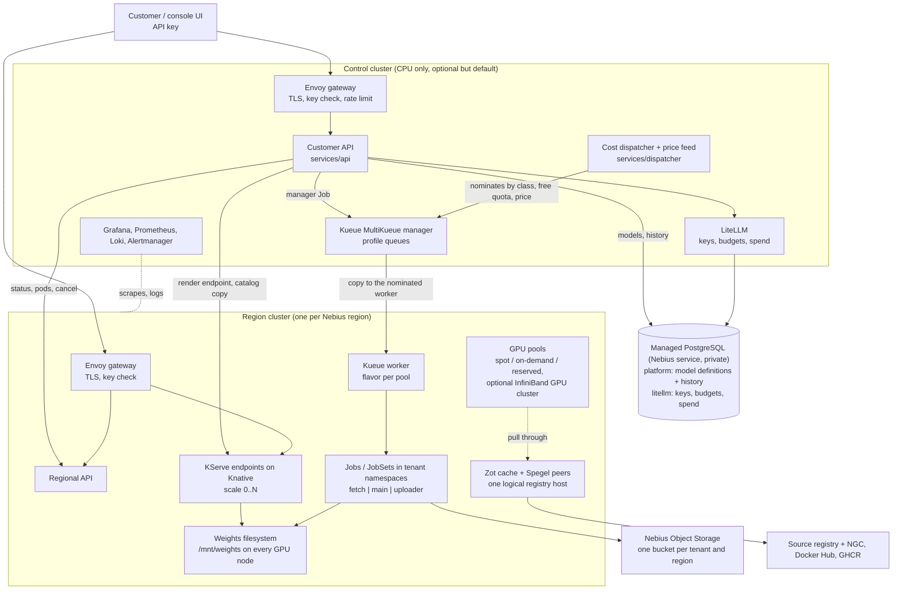
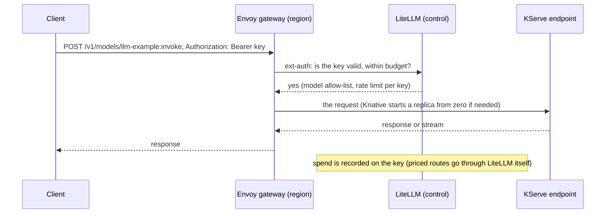

# Architecture

*For architects who evaluate or extend the platform, and for the security review. The owner's history
of how the design was reached is in `DECISIONS.md`.*

## Components



Every region cluster is identical; the control cluster is the only place where tenants' keys, the
MultiKueue manager and the dispatcher live. `control_plane.dedicated = false` folds the control
cluster's services onto the first region's system pool for a single-region proof of concept (no
MultiKueue: jobs are admitted locally).

The fleet database sits next to the control cluster: one Nebius Managed Service for PostgreSQL cluster
(`<fleet>-db`, PostgreSQL 16, session-mode pooler) in the control plane's project and region, created by
the cloud stage (`stack/cloud/database.tf`). It has no public access; the control cluster's nodes reach
its private endpoint through the VPC of the control subnet. Two databases: `platform` (the bootstrap
database: model definitions and their history, owned by the control API) and `litellm` (API keys,
budgets, spend; created by a Job of the platform stage). Backups and point-in-time restore are the
service's (`control_plane.database.backup_retention`, 14 days by default). Because the service exists in
some regions only, the control plane must be in one of them (`REQUIREMENTS.md`).

## Model definitions

A model is runtime input, not Terraform input. The control API (the only API with `DATABASE_URL`, from
Secret `api/database`) takes `POST /v1/models` from the console's "New model" form or from a client with
an admin key, validates the spec (a container plus a few knobs: image, command, args, env, port,
protocol, GPU count and classes, scaling, regions, weights; `services/api/models.py`), turns it into a
catalog entry and:

1. stores spec and entry in table `models` and the write in `models_history` (`GET /v1/models/{id}/history`);
2. renders the endpoint on every cluster of the model's regions with `charts/endpoint` (`helm template`
   in the API image, server-side apply through the api-agent identities: Roles
   `serverless2-api-agent-models` and `serverless2-api-agent-catalog`);
3. registers an OpenAI endpoint as a LiteLLM model group whose `api_base` is the endpoint's gateway
   hostname under that region's domain (`ENDPOINT_DOMAINS`);
4. writes a read-only ConfigMap copy `catalog-<id>` into the `api` namespace of every other region.

A regional API serves those copies and answers writes with 409 pointing at the fleet API. The built-in
classes (`catalog/models`: `hello-run`, `container-run`, `distributed-run`) stay files and are read-only.
`images` (per GPU class), `deployments.<region>.variants` and `routing` are accepted and stored but not
acted on yet (`DESIGN-REVIEW-2026-10-09.md`).

## Request path: an endpoint call



`mode: async` is the same call wrapped in a small Job: the job's pod calls the endpoint through the
gateway with the caller's key, retries while the endpoint wakes up, and writes the answer to the
tenant's bucket; the client polls the operation.

## Job path: a run with queueing, placement and resume

```mermaid
sequenceDiagram
    participant C as Client
    participant A as Customer API (control)
    participant K as Kueue manager + dispatcher
    participant W as Region cluster (worker)
    participant S as Tenant bucket
    C->>A: POST /v1/models/container-run:invoke {mode: run, input}
    A->>K: Job in the tenant namespace, managedBy MultiKueue, queue prefer-<class>
    K->>K: quota reserved; dispatcher nominates the cheapest free pool of the class
    K->>W: Workload and Job copied to the nominated worker
    W->>W: Kueue admits on a pool flavor; dispatcher creates the work volume there
    W->>S: fetch inputs; main runs; uploader streams checkpoints and outputs
    W-->>K: status mirrored back (region = the admitting cluster)
    C->>A: GET /v1/operations/{id}
    A->>W: pods, attempts, logs
    A-->>C: QUEUED / RUNNING / SUCCEEDED / FAILED, attempts, cost
    Note over W: spot preemption: the replacement pod reattaches the volume in the same region
    C->>A: POST /v1/operations/{id}:resume (after FAILED or CANCELLED)
    A->>K: a new Job pinned to that region, same volume, resumes from the checkpoint
```

Multi-node runs (`nodes: N`) are JobSets: N whole-node pods on one InfiniBand pool, rank environment
for torchrun and NCCL, the fabric NICs claimed through DRA, restart-all on any pod loss and resume from
the shared checkpoint directory. `JOBS.md` has the details and the limits.

## Components and versions

| Capability | Component | Notes |
|---|---|---|
| Clusters, nodes, capacity | Nebius Managed Kubernetes, node groups with the autoscaler, spot pricing policies, capacity blocks, GPU clusters for InfiniBand | `stack/modules/cluster` |
| Ingress, TLS, key check | Envoy Gateway, cert-manager (Let's Encrypt), ext-auth to LiteLLM | `EDGE.md` |
| Endpoints | KServe on Knative Serving | `charts/endpoint`, `catalog/models` |
| Fleet database | Nebius Managed Service for PostgreSQL, databases `platform` and `litellm` | `stack/cloud/database.tf`, `stack/platform/database.tf`; `OPERATIONS.md` "Database" |
| Model definitions | the control API, `services/api/models.py` and `db.py`, `charts/endpoint` | `POST/PUT/DELETE /v1/models`, history per model, read-only copies per region |
| Keys, budgets, per-call prices | LiteLLM proxy on the fleet database | keys per tenant, pass-through routes with a price |
| Queued calls and runs | Kubernetes Jobs, JobSet, the 30 MB runner image | `JOBS.md` |
| Queueing, quotas, priorities, cross-region placement | Kueue with MultiKueue, the cost dispatcher | `SCHEDULING.md` |
| Image cache | Zot (pull-through) and Spegel (peer-to-peer) behind one logical host, pre-pull per pool | `IMAGES.md` |
| Observability and cost | kube-prometheus-stack, Loki, Alloy, DCGM exporter, OpenCost with Nebius prices | `OBSERVABILITY.md` |
| Artifacts | Object Storage buckets with policies and lifecycle rules, presigned URLs | one bucket per tenant per region |
| Operations | spot-node recovery CronJob, the database service's backups, seed-weights Job | `OPERATIONS.md` |

Pinned versions live in `clusters/common/apps/*.yaml`, one list for every cluster.

## Own code

| Piece | Where | Size | Why upstream does not cover it |
|---|---|---|---|
| Customer API | `services/api` | about 2,000 lines of Python with tests | one API over KServe, Jobs and LiteLLM: idempotency, status normalisation, resume, artifacts, tenancy |
| Cost dispatcher and price feed | `services/dispatcher` | about 550 lines | Kueue's MultiKueue needs an external dispatcher to place by price across regions |
| Job runner | `services/jobs` | about 150 lines of shell | fetch inputs, upload outputs and attempt records, call an endpoint |
| Ops image | `services/ops` | about 100 lines of shell | recover stopped spot VMs, Nebius CLI with service-account profiles |
| Three charts | `charts/fleet`, `charts/endpoint`, `charts/tenant` | Helm | queues and cache from the fleet definition, one endpoint, one tenant |
| Console | `ui` | TypeScript | a tenant's view over the customer API |

## Multi-region in one sentence each

- One cluster per region because a Nebius project is bound to one region.
- An endpoint lives in the regions its definition names (`regions`); a run goes where the dispatcher
  ranks it among those regions, or where the caller pins it.
- Model definitions are written once, on the control API, into the fleet database; every region reads
  its own copy.
- Images carry one logical host name everywhere; each cluster's cache fetches them once.
- A tenant has a namespace with the profile queues on every cluster and a bucket per region; runs placed
  by the fleet use the first region's bucket.
- Resume after a failure stays in the region of the original run (the checkpoint volume is there).

## Cold start, in order of effect

In-region image cache and peer-to-peer layers, pre-pull per pool, model weights on the region's shared
filesystem (seeded once), a warm floor per endpoint where the cold start is too long. Scale-to-zero is
granted per model from its measured cold start.

## Not here

DevPods, invoicing (usage events only), GPU process snapshots, a second admission authority for runs
(Kueue only), a second scaler (Knative for endpoints, Kueue for runs, the node-group autoscaler for
nodes), MCP tooling. GitOps is optional: Argo CD can be enabled as an operator UI, but the deployment
mechanism of this solution is Terraform.
